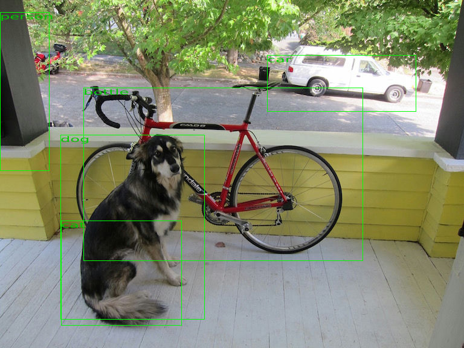
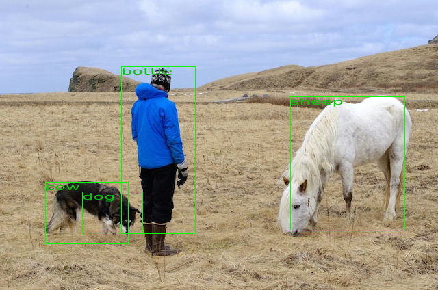

# yolo-plugin

Lenna Yolo Plugin

This plugin runs the yolo model to label objects in images.

Test it on [lenna.app](https://lenna.app/?just=https://lenna.app/yolo-plugin/remoteEntry.js).

## 🚴 Usage

You can test the lib by detecting objects in two images.

```sh
cargo run
```

The results are:





### 🔬 Test in Headless Browsers with `wasm-pack test`

```
wasm-pack test --node
```

## python version

The plugin can build python bindings.

### build

Create a virtual environment for python.

```bash
virtualenv -p python3 .venv
source .venv/bin/activate
pip install .
```

### usage

Import lenna_mobilenet_plugin in a python environment.

```python
from PIL import Image
from numpy import asarray
import lenna_yolo_plugin
print(lenna_yolo_plugin.description())

image = Image.open('assets/dog.jpg')
data = asarray(image)
print(data.shape)

config = lenna_yolo_plugin.default_config()
processed = lenna_yolo_plugin.process(config, data)
print(processed.shape)
Image.fromarray(processed).save('lenna_test_out.png')
```

### test

Run the python [test file](src/test.py) which loads the [lenna.png](assets/lenna.png) and converts it.

```bash
pip install pillow numpy
python src/test.py
```

### jupyter notebook

Find an example in [example.ipynb](example.ipynb)

```bash
pip install jupyter
jupyter notebook example.ipynb
```


## Sources:

The model is from [tiny-yolov2 on onnx](https://github.com/onnx/models/tree/master/vision/object_detection_segmentation/tiny-yolov2).

The class names are from [voc names on darknet](https://github.com/pjreddie/darknet/blob/master/data/voc.names).

### Paper

"YOLO9000: Better, Faster, Stronger" [arXiv:1612.08242](https://arxiv.org/pdf/1612.08242.pdf)
